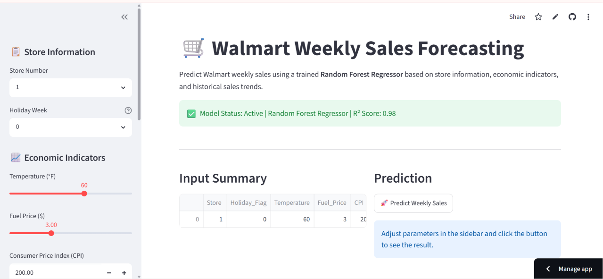
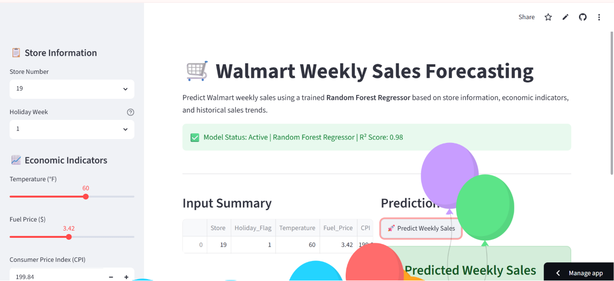

# 🛒 Walmart Weekly Sales Forecasting

An end-to-end Machine Learning project to predict weekly sales using economic indicators and historical trends.

## 🚀 Live Demo
**Check out the live application here:** [Live App Link](https://walmart-sales-forecasting-dqsn5cr5euoskjamxz9rwv.streamlit.app/)

## 🖼️ Application Gallery

  
   
  

## 📊 Project Overview
The goal of this project is to forecast the weekly sales of Walmart stores. I used a combination of economic data (CPI, Unemployment, Fuel Price) and time-series features to build a high-accuracy prediction model.

## 🛠️ Tech Stack
- **Language:** Python
- **Libraries:** Pandas, NumPy, Scikit-Learn, Matplotlib, Seaborn
- **Model:** Random Forest Regressor
- **Deployment:** Streamlit Cloud

## 📈 Key Results
- **Model Performance:** Achieved an **R² score of 0.98**.
- **Key Insight:** Time-series lag features (previous week's sales) were the strongest predictors of future sales.
- **Deployment:** Fully deployed as an interactive web app for real-time predictions.

## 📁 Folder Structure
- `app.py`: The Streamlit web application.
- `walmart_model_rf.pkl`: The trained Random Forest pipeline.
- `data/`: Contains the raw Walmart dataset.
- `notebooks/`: Detailed EDA and model training process.
